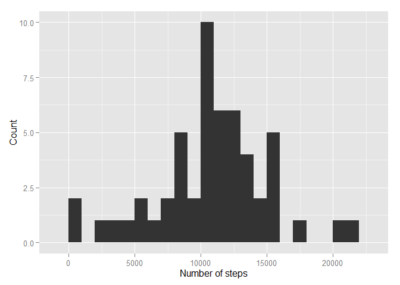
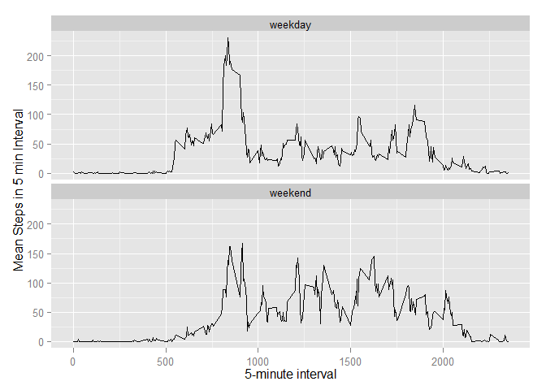

# Reproducible Research: Peer Assessment 1


## Loading and preprocessing the data

```r
data <- read.csv(unz("activity.zip", "activity.csv"), na.strings = "NA", header = TRUE, colClasses = c("numeric", "Date", "numeric" ))
str(data)
```

```
## 'data.frame':	17568 obs. of  3 variables:
##  $ steps   : num  NA NA NA NA NA NA NA NA NA NA ...
##  $ date    : Date, format: "2012-10-01" "2012-10-01" ...
##  $ interval: num  0 5 10 15 20 25 30 35 40 45 ...
```

## What is mean total number of steps taken per day?
Follows an histogram representing the total number of steps perfomed in one day:

```r
hist_data <- aggregate(steps ~ date , data, sum, na.rm = TRUE) 

library(ggplot2)
qplot(hist_data$steps, binwidth = 1000) +
      xlab("Number of steps") + ylab("Count")
```

 

**The mean and meadian of steps taken per day is shown below:**

```r
mean(hist_data$steps)
```

```
## [1] 10766
```

```r
median(hist_data$steps)
```

```
## [1] 10765
```

## What is the average daily activity pattern?
Here a time series plot of the 5-minute interval and the average number of steps
taken, averaged across all days:

```r
time_serie_mean <- aggregate(steps ~ interval , data, mean, na.rm = TRUE) 
ggplot(time_serie_mean, aes(interval, steps)) + geom_line() +
      xlab("5-minute interval") + ylab("Mean Steps in 5 min Interval")
```

 

**5-minute Interval with the most steps in average is: 
835.**

## Imputing missing values

```r
uncomplete_rows <- sum(complete.cases(data) == FALSE)
```
The number of row with NA is: 2304

NAs will be set equal to the mean of that 5-minute interval across the whole 
data set and stored in data2:

```r
data2 <- data
data2[complete.cases(data2) == FALSE, c("steps")] <- time_serie_mean[sapply(data2[complete.cases(data2) == FALSE, c("interval")], function(x) which(time_serie_mean$interval==x)), c("steps")]
str(data2)
```

```
## 'data.frame':	17568 obs. of  3 variables:
##  $ steps   : num  1.717 0.3396 0.1321 0.1509 0.0755 ...
##  $ date    : Date, format: "2012-10-01" "2012-10-01" ...
##  $ interval: num  0 5 10 15 20 25 30 35 40 45 ...
```
  
Follows an histogram representing the total number of steps perfomed in one day 
(after the NA correction):

```r
hist_data2 <- aggregate(steps ~ date , data2, sum, na.rm = TRUE) 

library(ggplot2)
qplot(hist_data2$steps, binwidth = 1000) +
      xlab("Number of steps") + ylab("Count")
```

 

**The mean and meadian of steps taken per day is shown below (NA correction
applied:**

```r
mean(hist_data2$steps)
```

```
## [1] 10766
```

```r
median(hist_data2$steps)
```

```
## [1] 10766
```


## Are there differences in activity patterns between weekdays and weekends?
Differences shown in the plot below:

```r
weekend <- factor(weekdays(data2$date) == "domenica" | 
                      weekdays(data2$date) == "sabato", 
                  levels = c("FALSE", "TRUE"), labels = c("weekday", "weekend"))
data2 <- cbind(data2, weekend)
time_serie_mean2 <- aggregate(steps ~ interval + weekend , data2, mean) 
ggplot(time_serie_mean2, aes(x=interval, y=steps)) + geom_line() + 
    facet_wrap( ~ weekend, ncol=1) +
      xlab("5-minute interval") + ylab("Mean Steps in 5 min Interval")
```

 
